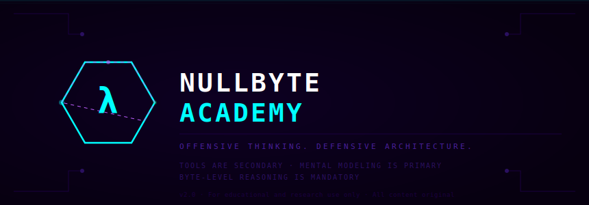
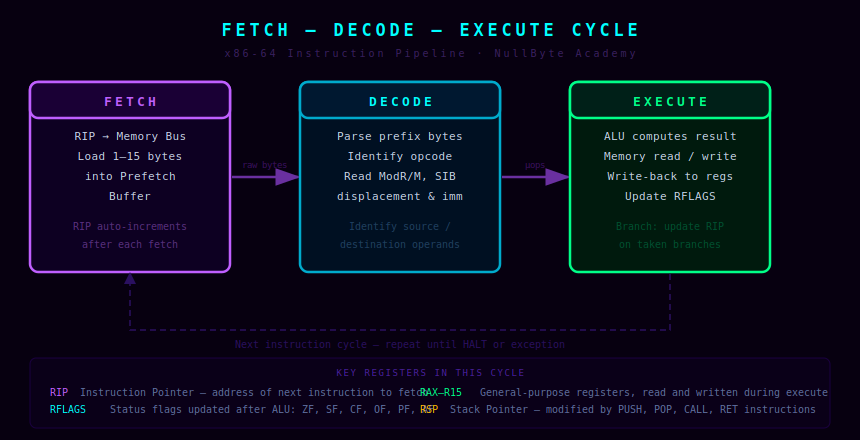
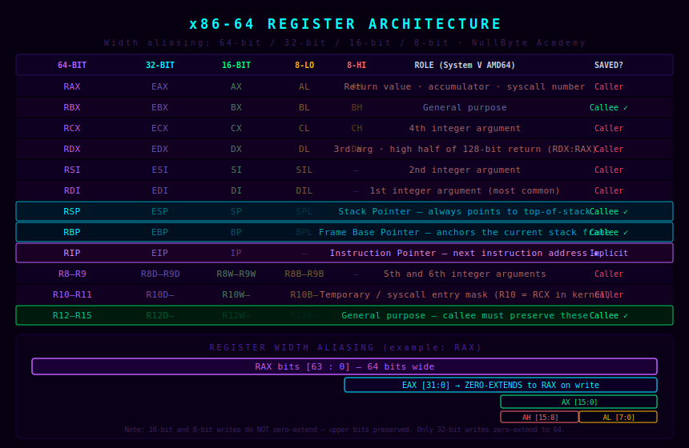
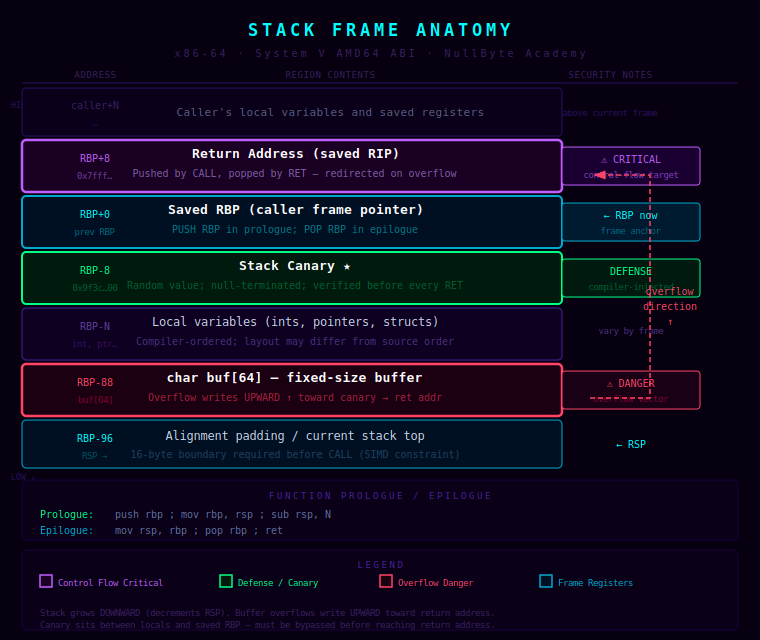
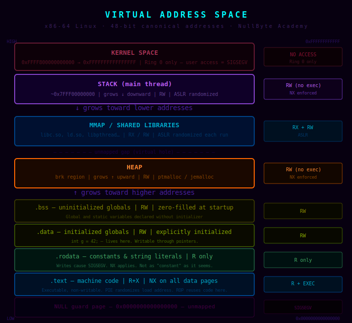
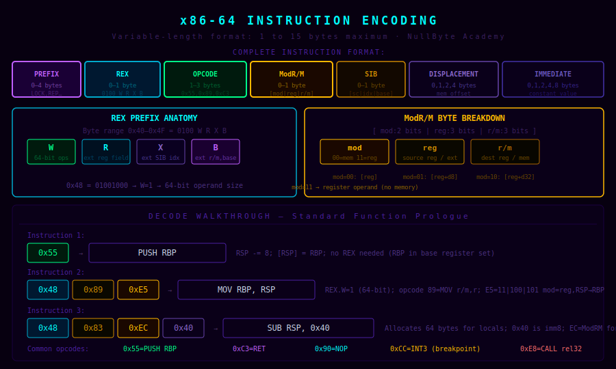
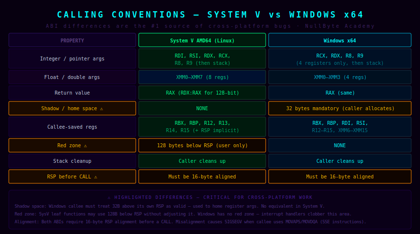
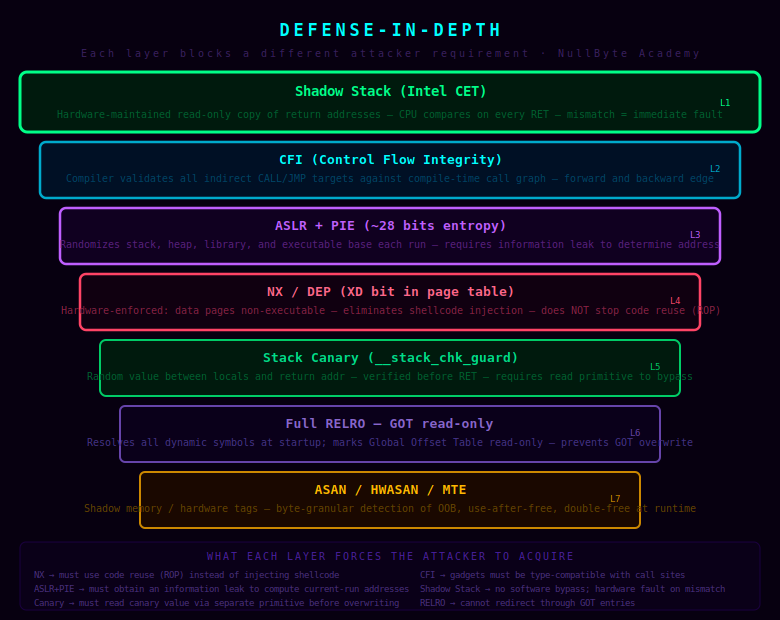
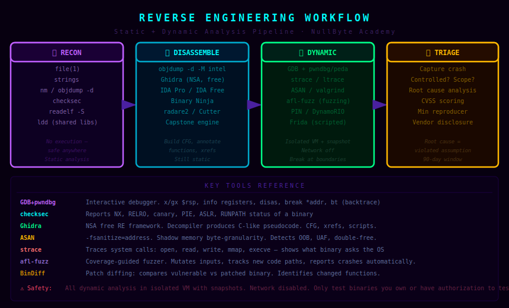
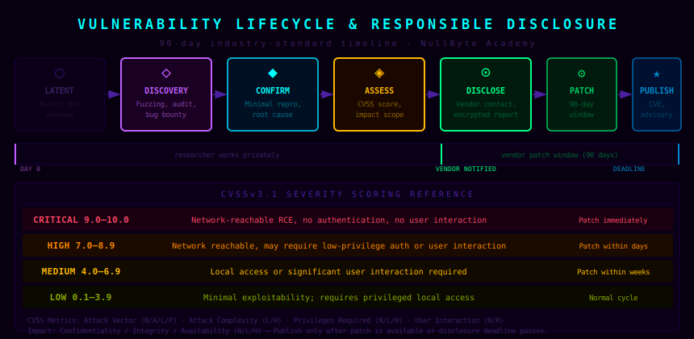

# NullByte Academy — Curriculum Reference Guide

> **Offensive thinking. Defensive architecture. Byte-level reasoning is mandatory.**

---



*Figure 0 — NullByte Academy course identity. The hexagon with missing vertex represents an asymmetric attack surface — always one edge less defended than you think.*

---

## Table of Contents

1. [The CPU Execution Model](#1-the-cpu-execution-model)
2. [x86-64 Register Architecture](#2-x86-64-register-architecture)
3. [Stack Frame Anatomy](#3-stack-frame-anatomy)
4. [Virtual Address Space](#4-virtual-address-space)
5. [x86-64 Instruction Encoding](#5-x86-64-instruction-encoding)
6. [Calling Conventions](#6-calling-conventions)
7. [Memory Corruption Classes](#7-memory-corruption-classes)
8. [Protection Systems & Defense-in-Depth](#8-protection-systems--defense-in-depth)
9. [Reverse Engineering Methodology](#9-reverse-engineering-methodology)
10. [Vulnerability Research & Responsible Disclosure](#10-vulnerability-research--responsible-disclosure)
11. [Practical Lab Guide — StackDiagram](#11-practical-lab-guide--stackdiagram)
12. [Quick Reference — Opcodes & GDB Commands](#12-quick-reference--opcodes--gdb-commands)

---

## 1. The CPU Execution Model

Every instruction your processor runs passes through the same three-phase cycle. Understanding this cycle at the hardware level — not the abstraction level — is what separates engineers who truly understand execution from those who only use it.



*Figure 1 — The fetch-decode-execute cycle. RIP is the engine's crankshaft: it drives every phase and is the primary target of control-flow attacks.*

### 1.1 Fetch

The CPU reads up to 15 bytes from the memory address currently stored in **RIP** (the Instruction Pointer) into the processor's internal instruction register. This is a memory operation — it goes through the cache hierarchy (L1i → L2 → L3 → RAM). RIP is then incremented by the number of bytes consumed, pointing to the next instruction.

Key insight: at the moment of fetch, the CPU has no idea what those bytes mean. It is simply reading raw bytes from an address.

### 1.2 Decode

The pre-decode and decode units parse the raw bytes according to the x86-64 instruction format: optional legacy prefixes, an optional REX prefix, a 1–3 byte opcode, an optional ModR/M byte, an optional SIB byte, an optional displacement, and an optional immediate. This phase identifies the operation, its operands (which registers or memory addresses are involved), and the operand sizes.

The decoder also identifies whether the instruction is a branch, a memory access, or a register-only operation — this affects scheduling in out-of-order processors.

### 1.3 Execute

The appropriate execution unit — the ALU for arithmetic, the AGU for address generation, the FPU for floating-point — carries out the operation. Results are written to destination registers or memory. The **RFLAGS** register is updated to reflect the outcome (zero flag, carry flag, sign flag, overflow flag, etc.).

Control flow instructions (JMP, CALL, RET, Jcc) modify RIP during this phase, redirecting the next fetch.

### 1.4 Why This Matters for Security

Control-flow attacks — stack overflows, return-oriented programming, jump-oriented programming — all exploit the same fact: **RIP is data**. During a normal CALL, the CPU pushes the return address (the next RIP value) onto the stack as 8 bytes of data. If an attacker can overwrite those 8 bytes before the corresponding RET executes, they control where the CPU fetches next.

```
Normal execution:
  CALL target    →  pushes RIP+5 to stack  →  RIP = target

After return address overwrite:
  RET            →  pops attacker_addr     →  RIP = attacker_addr
```

This is not a bug in the CPU. It is a correct implementation of the specification, operating on corrupted data.

---

## 2. x86-64 Register Architecture

The x86-64 ISA provides 16 general-purpose 64-bit registers, each with 32-bit, 16-bit, and 8-bit sub-register aliases that reference portions of the same underlying physical register.



*Figure 2 — Register width aliasing. The critical rule: writing a 32-bit register (EAX) zero-extends the upper 32 bits of the 64-bit register (RAX). Writing 16-bit or 8-bit sub-registers does NOT zero-extend — upper bits are preserved.*

### 2.1 General-Purpose Registers

| Register | 32-bit | 16-bit | 8-bit Lo | Primary Role (System V) |
|----------|--------|--------|----------|------------------------|
| RAX | EAX | AX | AL | Return value, accumulator |
| RBX | EBX | BX | BL | General purpose (callee-saved) |
| RCX | ECX | CX | CL | 4th integer argument |
| RDX | EDX | DX | DL | 3rd argument; RDX:RAX for 128-bit returns |
| RSI | ESI | SI | SIL | 2nd argument |
| RDI | EDI | DI | DIL | 1st argument |
| RSP | ESP | SP | SPL | Stack pointer — always points to top of stack |
| RBP | EBP | BP | BPL | Base pointer — frame anchor |
| R8–R15 | R8D–R15D | R8W–R15W | R8B–R15B | Args 5–6; R12–R15 callee-saved |

### 2.2 Special-Purpose Registers

**RIP** — The instruction pointer. Points to the next instruction to be fetched. Cannot be read or written directly in x86-64 user-space code (unlike older ISAs). It is implicitly modified by every control-flow instruction: CALL, RET, JMP, Jcc.

**RFLAGS** — 64-bit flags register. Critical bits for security analysis:

```
Bit 0  — CF  Carry Flag     (unsigned overflow)
Bit 6  — ZF  Zero Flag      (result == 0)
Bit 7  — SF  Sign Flag      (result MSB == 1)
Bit 11 — OF  Overflow Flag  (signed overflow)
```

### 2.3 The Width Aliasing Trap

```
; After: MOV RAX, 0xDEADBEEFCAFEBABE
;   RAX = 0xDEADBEEFCAFEBABE
;   EAX = 0xCAFEBABE  (lower 32 bits)
;   AX  = 0xBABE      (lower 16 bits)
;   AL  = 0xBE        (lower 8 bits)

; Now execute: MOV EAX, 0x1234
;   RAX becomes: 0x0000000000001234   ← upper 32 bits ZEROED
;   This is intentional by design — prevents partial-register stalls

; But: MOV AX, 0x1234
;   RAX becomes: 0xDEADBEEF00001234   ← upper 48 bits PRESERVED
```

This asymmetry is the source of subtle correctness bugs. Compilers know this rule; hand-written assembly must respect it explicitly.

---

## 3. Stack Frame Anatomy

The stack is the runtime backbone of every function call. It is a Last-In-First-Out (LIFO) region of memory that stores return addresses, saved registers, local variables, and function arguments. Understanding its precise layout is essential for understanding both program behavior and the spatial mechanics of stack-based vulnerabilities.



*Figure 3 — Complete x86-64 stack frame. Stack grows downward (toward lower addresses). A buffer overflow writes upward, toward the canary, then saved RBP, then the return address. The canary's position is precisely its value as a sequential write barrier.*

### 3.1 Frame Construction — The Prologue

Every non-leaf function begins with a standardized prologue:

```asm
push rbp          ; 0x55 — save caller's frame pointer
mov  rbp, rsp     ; 0x48 0x89 0xE5 — anchor new frame
sub  rsp, N       ; allocate N bytes for locals (N is 16-byte aligned)
```

After the prologue, the stack looks like this:

```
Higher addresses
┌─────────────────────────────────┐
│  ... caller's locals ...        │  ← caller's frame
├─────────────────────────────────┤
│  Return Address  [RBP + 8]      │  ← saved RIP (pushed by CALL)
├─────────────────────────────────┤
│  Saved RBP       [RBP + 0]      │  ← current RBP points here
├─────────────────────────────────┤
│  Stack Canary    [RBP - 8]      │  ← compiler-inserted guard
├─────────────────────────────────┤
│  Local Variables [RBP - 16...]  │
├─────────────────────────────────┤
│  char buf[64]    [RBP - 88]     │  ← fixed-size buffer
├─────────────────────────────────┤
│  Alignment pad   [RSP]          │  ← RSP, 16-byte aligned
└─────────────────────────────────┘
Lower addresses
```

### 3.2 Frame Teardown — The Epilogue

```asm
mov  rsp, rbp     ; restore RSP to saved frame position
pop  rbp          ; restore caller's RBP
ret               ; pop [RSP] into RIP — control returns to caller
```

The `ret` instruction is equivalent to `pop rip`. Whatever bytes are at `[RSP]` become the next instruction address. If those bytes have been modified by an overflow, the CPU faithfully executes the attacker's redirect.

### 3.3 The Stack Canary

The stack canary is a random value placed between the local variables and the saved RBP/return address. It is:

- Generated once per process from `/dev/urandom` at startup
- Stored in a thread-local variable (`__stack_chk_guard`)
- Inserted into the frame by the compiler during the prologue
- **Verified before every `ret`** by the compiler-inserted epilogue check

```asm
; Epilogue with canary check (compiled code):
mov  rax, QWORD PTR [rbp-8]           ; load canary from frame
xor  rax, QWORD PTR fs:0x28           ; compare with master value
jne  __stack_chk_fail                 ; mismatch → abort
mov  rsp, rbp
pop  rbp
ret
```

The canary always includes a null byte (`0x00`) in its least-significant byte position. This terminates string functions — if an overflow is delivered through `strcpy`, the null byte in the canary prevents overwriting past it using string-based delivery. The canary must be *leaked* (read via a separate vulnerability) before it can be preserved correctly in a controlled overwrite.

### 3.4 Red Zone

On Linux (System V ABI), functions that make no further calls (leaf functions) may use the 128 bytes below RSP as scratch space *without adjusting RSP*. This region is called the **red zone**. Signal handlers are guaranteed not to clobber it. This allows the compiler to elide the `sub rsp, N` instruction for simple leaf functions, improving performance.

**Kernel code** must never use the red zone — hardware interrupts can fire at any moment and will clobber memory below RSP.

---

## 4. Virtual Address Space

Every running process operates in its own isolated virtual address space — a mapping from virtual addresses to physical memory pages managed by the OS and MMU. On x86-64 Linux, this space is 48 bits wide (256 TiB), split between user space (low half) and kernel space (high half).



*Figure 4 — Linux x86-64 virtual address space. Each region has distinct permissions (R/W/X), growth direction, and randomization characteristics. A "canonical hole" exists between the user and kernel halves — any pointer into it causes an immediate fault.*

### 4.1 Key Regions

**`.text` (Code Segment)**
Permissions: `R-X` (readable, executable, not writable). Contains all compiled machine instructions. Attempting to write to `.text` causes SIGSEGV. With PIE enabled, the base address is randomized by ASLR each run.

**`.rodata` (Read-Only Data)**
Permissions: `R--`. String literals (`"hello\n"`), `const` arrays, switch-statement jump tables. Writable only through explicit `mprotect()` — accidental writes fault immediately.

**`.data` / `.bss` (Initialized / Uninitialized Globals)**
Permissions: `RW-`. Mutable global and static variables. `.bss` is zero-filled by the OS before the program starts. These sections are a common target for attackers who need a stable, writable memory location.

**Heap**
Permissions: `RW-` (NX enforced). Grows **upward** toward higher addresses. Managed by `ptmalloc` (glibc). Each allocation has a header containing size, flags, and free-list pointers adjacent to user data — making heap overflows capable of corrupting allocator metadata.

**Memory-Mapped Region (mmap)**
Permissions: vary. Shared libraries (`libc.so`, `ld.so`), `mmap()` allocations, and file mappings live here. ASLR randomizes the base of this region. The most common ROP gadget sources are in `libc` — which is why leaking a `libc` address is usually the first step in a modern exploit chain.

**Stack**
Permissions: `RW-` (NX enforced). Grows **downward** toward lower addresses. Has a hard size limit (typically 8 MB, controlled by `ulimit -s`). Accessing past the guard page causes SIGSEGV.

**Kernel Space**
Inaccessible from Ring 3 user space. Any access generates an immediate general protection fault (#GP). The boundary is enforced by the MMU — no software override is possible from user space.

### 4.2 ASLR and the Information Leak Requirement

ASLR randomizes the base addresses of the stack, heap, and libraries at process creation. With PIE, the binary's own code is also randomized. The result: every pointer to every region is different on each run.

```
Without ASLR (predictable):
  libc base: 0x00007ffff7800000  (same every run)

With ASLR (randomized):
  Run 1:  libc base: 0x00007f8a3c400000
  Run 2:  libc base: 0x00007f1b9f200000
  Run 3:  libc base: 0x00007fd42e100000
```

An attacker who needs to call `system("/bin/sh")` must know the address of `system` in the current run. This requires a **separate read primitive** (format string, out-of-bounds read, use-after-free information disclosure) to leak a pointer from the target region, compute the base address by subtracting the known offset, and then derive all other addresses. This is why modern exploits are multi-stage — the leak and the control-flow hijack are separate phases.

---

## 5. x86-64 Instruction Encoding

x86-64 uses a variable-length encoding: instructions are 1 to 15 bytes. The format was inherited from the 8086 (1978) and extended repeatedly — 16-bit, 32-bit (386), and 64-bit (AMD64 in 2003). Understanding encoding lets you read raw hex dumps, decode shellcode, identify ROP gadgets, and understand disassembler output at the byte level.



*Figure 5 — Full x86-64 instruction format. The REX prefix and ModR/M byte are the two most important fields for understanding 64-bit code. Not all fields are present in every instruction — only opcode is mandatory.*

### 5.1 The REX Prefix

The REX prefix byte occupies values `0x40` through `0x4F`. Its 4 payload bits extend the instruction to operate in 64-bit mode and to access the 8 new registers (R8–R15) added by AMD64:

```
REX byte layout:  0 1 0 0  W  R  X  B
                  ─────── ── ── ── ──
                  Fixed   64 reg SIB r/m
                          op ext  idx ext

0x40 = 0100 0000  →  all extension bits 0 (REX present, no extensions)
0x48 = 0100 1000  →  REX.W = 1, forces 64-bit operand size
0x49 = 0100 1001  →  REX.W = 1, REX.B = 1 (extends r/m or opcode reg)
0x4C = 0100 1100  →  REX.W = 1, REX.R = 1 (extends ModR/M reg field)
```

Without a REX.W prefix, most instructions default to 32-bit operand size (and zero-extend to 64 bits on write, as discussed in §2.3).

### 5.2 The ModR/M Byte

The ModR/M byte encodes the addressing mode and register selection for instructions with memory or register operands. Its three fields:

```
ModR/M byte:   [ mod : 2 bits ] [ reg : 3 bits ] [ r/m : 3 bits ]

mod = 00  →  Memory access, no displacement  (except r/m=101 → RIP-relative)
mod = 01  →  Memory access + 8-bit signed displacement
mod = 10  →  Memory access + 32-bit signed displacement
mod = 11  →  Register operand (both operands are registers)

Decoding 0xE5:  binary = 1110 0101
  mod = 11   (register-to-register)
  reg = 100  (RSP)
  r/m = 101  (RBP)

Combined with opcode 0x89 (MOV r/m64, r64):
  Destination = r/m = RBP
  Source      = reg = RSP
  Result: MOV RBP, RSP   ← second instruction of function prologue
```

### 5.3 Decoding the Function Prologue

Every standard function begins with the same byte sequence. Here it is decoded completely:

```
Bytes:    55        48 89 E5        48 83 EC 40
          ──        ────────        ───────────
Assembly: PUSH RBP  MOV RBP,RSP    SUB RSP, 64

55:       PUSH r64 with reg field = 5 (RBP)
          RSP -= 8; [RSP] = RBP

48 89 E5: 48 = REX.W (64-bit)
          89 = MOV r/m64, r64
          E5 = ModR/M (mod=11, reg=RSP, r/m=RBP) → MOV RBP, RSP

48 83 EC 40:
          48 = REX.W
          83 = SUB r/m64, imm8
          EC = ModR/M (mod=11, /5=SUB, r/m=RSP)
          40 = immediate = 64 decimal
          → SUB RSP, 64  (allocate 64 bytes)
```

### 5.4 Important Single-Byte Opcodes

| Opcode | Instruction | Security Significance |
|--------|------------|----------------------|
| `0x90` | `NOP` | Alignment padding; NOP sled in shellcode (historical) |
| `0x55` | `PUSH RBP` | Function prologue; marks frame boundary |
| `0xC3` | `RET` | Near return; ROP chain terminator |
| `0xCC` | `INT3` | Software breakpoint; used by debuggers |
| `0x0F 0x05` | `SYSCALL` | Ring 3→0 transition; syscall number in RAX |
| `0xE8 xx xx xx xx` | `CALL rel32` | Direct call; next 4 bytes = relative displacement |
| `0xFF /2` | `CALL r/m64` | Indirect call; target from register/memory |
| `0xFF /4` | `JMP r/m64` | Indirect jump; vtable dispatch |

The `0xFF /4` indirect JMP is the primary target of forward-edge Control Flow Integrity — it must only be allowed to jump to type-compatible function entry points.

---

## 6. Calling Conventions

A calling convention is a binding contract between caller and callee specifying exactly how function arguments are passed, how return values come back, which registers must be preserved across a call, and how the stack must be maintained. Violating this contract produces undefined behavior — typically a crash, sometimes a silent data corruption.



*Figure 6 — System V AMD64 (Linux) versus Windows x64 calling convention. The differences in argument registers, shadow space, and red zone are the most common source of cross-platform ABI bugs.*

### 6.1 System V AMD64 ABI (Linux, macOS, BSD)

**Integer and pointer arguments** are passed in registers, in this fixed order:
```
1st: RDI    4th: RCX
2nd: RSI    5th: R8
3rd: RDX    6th: R9
```
Arguments beyond the 6th spill to the stack (pushed right-to-left). The caller is responsible for cleaning them up.

**Floating-point arguments** use XMM0–XMM7 (8 registers).

**Return values** use RAX for integers/pointers. 128-bit returns use RDX:RAX. Floating-point returns use XMM0.

**Callee-saved registers** — the callee *must* preserve: `RBX, RBP, R12, R13, R14, R15`. All others are caller-saved (may be freely modified by the callee).

### 6.2 Windows x64 ABI

**Integer arguments** use only 4 registers: `RCX, RDX, R8, R9`. The 5th and beyond go to the stack.

**Shadow space** — Windows requires the caller to allocate 32 bytes of stack space before every CALL, regardless of whether the callee uses it. This "home space" allows the callee to spill its 4 register arguments to the stack for debugger visibility. Linux has no such requirement.

**Red zone** — Windows does not define a red zone. Interrupt handlers may use the stack space below RSP freely.

**Callee-saved registers** — Windows adds `RDI` and `RSI` to the callee-saved set: `RBX, RBP, RDI, RSI, R12–R15`.

### 6.3 Stack Alignment Requirement

Both ABIs require RSP to be **16-byte aligned immediately before a CALL instruction** executes. This is because the callee may use SIMD instructions (MOVAPS, MOVDQA) that fault on misaligned accesses.

A CALL pushes 8 bytes, temporarily breaking alignment. The callee's `PUSH RBP` restores it. The `SUB RSP, N` in the prologue must choose N such that RSP remains 16-byte aligned throughout the function body.

```
Before CALL:  RSP % 16 == 0   (caller ensures this)
After CALL:   RSP % 16 == 8   (8-byte return address pushed)
After PUSH RBP: RSP % 16 == 0 (8 more bytes pushed — aligned again)
After SUB RSP, 32: RSP % 16 == 0 (32 is divisible by 16 — still aligned)
```

A misaligned RSP that reaches a MOVAPS inside glibc's `printf` or `memcpy` produces a crash that can be confusing without this knowledge. The fix is always to add a RET gadget or extra PUSH to adjust RSP by 8 before the problematic call.

---

## 7. Memory Corruption Classes

Memory corruption vulnerabilities arise whenever a program reads or writes memory outside the bounds of its allocated region, or accesses memory in an incorrect temporal order. Understanding the taxonomy is essential for both exploitation and defense — each class has different root causes, different detection strategies, and different mitigations.

### 7.1 Stack Buffer Overflow

A fixed-size buffer on the stack is written beyond its declared bounds. Because the stack grows downward and overflow writes upward, the write path threatens — in order — the stack canary, saved RBP, and saved return address.

```
Stack (low → high address):
  [buf: 64 bytes]  [locals]  [canary]  [saved RBP]  [return addr]
                                  ↑
               overflow writes upward through each field
```

**Root causes:** `gets()`, `strcpy()`, `scanf("%s")`, `sprintf()` without bounds, unchecked `read()` lengths, manual index arithmetic errors.

**Detection:** ASAN (`-fsanitize=address`), stack canaries (`-fstack-protector-strong`), fuzzing with AFL.

**Mitigation:** Replace unbounded functions; use `fgets()`, `strncpy()`, `snprintf()`; validate all lengths before copying; enable canaries; enable ASLR+PIE; enable NX.

### 7.2 Heap Corruption

Heap corruption occurs when a write exceeds the bounds of a heap allocation (heap overflow), accesses freed memory (use-after-free), or frees the same allocation twice (double-free).

```
Heap layout (ptmalloc chunks):
  ┌────────────────────┐
  │  prev_size  (8B)   │
  │  size|flags (8B)   │  ← chunk header
  ├────────────────────┤
  │  user data (N B)   │  ← malloc() returns pointer here
  ├────────────────────┤
  │  prev_size  (8B)   │
  │  size|flags (8B)   │  ← next chunk header — overwrite target
  ├────────────────────┤
  │  ...               │
```

Overflowing user data overwrites the next chunk's header. Depending on allocator version and configuration, this can enable the "House of Force," "Tcache poisoning," or other allocator-specific exploitation primitives.

**Use-after-free:** A pointer `p` is freed (`free(p)`), but `p` is not set to NULL. A subsequent write through `p` may corrupt a new allocation that reused that memory — potentially an object with a function pointer or vtable pointer.

### 7.3 Format String Vulnerabilities

When user-controlled input is passed directly as the format string argument to `printf` family functions, the attacker controls how the function interprets its argument list — which is read from the stack.

```c
// Vulnerable:
printf(user_input);           // user controls format string

// Safe:
printf("%s", user_input);     // user data is an argument, not a format
```

`%x` / `%p` reads values from the stack — enables information disclosure (leak canary, addresses).
`%n` writes the count of characters printed so far to a pointer argument — enables arbitrary write.

This is a particularly powerful primitive because it provides both a read channel (for leaking the canary and ASLR offsets) and a write channel (for the control-flow redirect) in a single vulnerability class.

### 7.4 Integer Overflow and Signedness

```c
void copy_data(char *dst, char *src, unsigned int len) {
    if (len > 1024) return;     // check seems safe...
    memcpy(dst, src, len);
}

// Call: copy_data(buf, src, -1)
// -1 as unsigned = 0xFFFFFFFF = 4294967295
// Passes the len > 1024 check (4294967295 is not > 1024 as signed)
// memcpy copies 4 GB → massive overflow
```

Signed/unsigned comparison confusion is one of the most common integer vulnerability patterns. Always use the correct type, apply bounds checks on the appropriate representation, and compile with `-fsanitize=integer` during testing.

### 7.5 Type Confusion

A pointer to an object of type A is used as if it pointed to an object of type B. In C++ this often involves incorrect downcasting. In C it occurs through void pointer misuse or union abuse. If types A and B have function pointers at different offsets, the wrong function pointer is called — producing controlled-but-undefined execution.

---

## 8. Protection Systems & Defense-in-Depth

Modern systems deploy multiple overlapping protections. No single mitigation is sufficient — each targets a different attacker requirement. The power of defense-in-depth comes from forcing an attacker to acquire multiple independent capabilities, each of which is individually difficult to obtain reliably.



*Figure 7 — The seven-layer protection stack. Each layer forces the attacker to acquire a new primitive. Compounding these requirements makes reliable exploitation exponentially harder.*

### 8.1 NX / DEP (Non-Executable Memory)

**What it prevents:** Executing shellcode injected into data regions (stack, heap, `.data`).

**Mechanism:** The x86-64 page table has a No-eXecute (NX) bit, also called the Execute Disable (XD) bit. When set, the MMU raises a fault if the CPU attempts to fetch an instruction from that page.

**What it does NOT prevent:** Return-Oriented Programming. ROP executes existing code in the `.text` section — pages that are legitimately executable. NX eliminates one attack class entirely but forces attackers toward ROP.

**Compile-time check:** `checksec ./binary` → look for `NX: enabled`.

### 8.2 ASLR + PIE

**What it prevents:** Using hardcoded addresses in payloads — requires an information leak to compute current-run addresses.

**ASLR** (Address Space Layout Randomization): OS-level feature. Randomizes the base addresses of the stack, heap, and shared libraries each time a process is created. Linux provides approximately 28 bits of entropy for library placement on 64-bit systems.

**PIE** (Position-Independent Executable): Compiler-level feature (`-fPIE -pie`). Makes the executable itself relocatable, allowing ASLR to also randomize the binary's load address. Without PIE, the `.text`, `.data`, and `.got` sections are at fixed addresses — partial ASLR bypass is trivial.

### 8.3 Stack Canary

**What it prevents:** Sequential stack overflows that attempt to overwrite the return address by writing through local variables.

**Mechanism:** A random 8-byte value (including a null byte at position 0) is placed at `[RBP-8]`, between the local variables and saved RBP. The compiler-generated epilogue checks this value before executing `ret`. Mismatch → `__stack_chk_fail()` → immediate abort.

**Bypass requirement:** The attacker must obtain the canary value before overwriting it. This requires a separate read primitive — a format string vulnerability, an out-of-bounds read, or a `%p`-style leak. Once leaked, the canary can be preserved correctly in the overflow payload.

### 8.4 Full RELRO

**What it prevents:** GOT (Global Offset Table) overwrite attacks.

**Mechanism:** Dynamic libraries are referenced through the PLT/GOT indirection. At first call, the dynamic linker resolves the symbol and writes its address into the GOT. With **Partial RELRO**, the GOT is writable at runtime — an attacker who controls an arbitrary write can redirect any library call by overwriting the GOT entry. **Full RELRO** resolves all symbols eagerly at startup, then remaps the GOT as read-only. GOT overwrite is no longer possible.

**Tradeoff:** Full RELRO slightly increases startup time (all symbols resolved upfront). On modern hardware this is imperceptible for typical programs.

### 8.5 Control Flow Integrity (CFI)

**Forward-edge CFI:** Validates targets of indirect CALL and JMP instructions. The compiler builds a valid target set at compile time (type-compatible functions). At runtime, before any indirect branch, the compiler inserts a check that the target is in the valid set. LLVM-CFI uses type hashing; KCFI (kernel CFI) uses a different scheme for indirect calls in the Linux kernel.

**Backward-edge CFI (Shadow Stack):** A separate, hardware-protected copy of return addresses. On every CALL, the CPU writes the return address to both the regular stack and the shadow stack. On every RET, the CPU compares `[RSP]` with the shadow stack top. Mismatch → immediate fault. Intel CET provides this in hardware — it cannot be bypassed by any software write because the shadow stack page is marked with a special page table attribute that prevents even supervisor-mode writes.

### 8.6 Hardware Memory Tagging (HWASAN / MTE)

ARM's Memory Tagging Extension (MTE) and its software predecessor HWASan assign a 4-bit "tag" to each 16-byte aligned memory granule. Every pointer carries a matching tag in its top byte (the top byte is architecturally unused in current ARM64 implementations). On every load/store, the hardware checks that the pointer's tag matches the allocation's tag. Mismatch → fault. This detects:

- Out-of-bounds accesses (pointer to different allocation has different tag)
- Use-after-free (freed memory tag is randomized on deallocation)
- Double-free (tag mismatch on second free)

MTE adds approximately 1–3% runtime overhead — production-deployable on mobile and embedded systems.

---

## 9. Reverse Engineering Methodology

Reverse engineering is the process of recovering the design and behavior of a system from its compiled artifacts. For security research, this means reconstructing the logic, data structures, and control flow of a binary without access to its source code.



*Figure 8 — The four-phase RE workflow: Recon (static, no execution) → Disassembly (static, with tools) → Dynamic Analysis (execution in isolated environment) → Crash Triage (root cause identification).*

### 9.1 Phase 1 — Reconnaissance (Static, No Execution)

Before running anything, gather maximum information from the binary without executing it. This phase is always safe to perform.

```bash
file ./target          # architecture, linkage, stripped?
strings ./target       # embedded strings, version info, URLs
nm ./target            # symbol table (if not stripped)
objdump -d ./target    # disassembly
readelf -S ./target    # section headers: .text, .data, .bss sizes
readelf -d ./target    # dynamic section: required libraries
checksec ./target      # NX, RELRO, PIE, canary status
ldd ./target           # shared library dependencies and paths
```

**Key questions to answer in recon:**
- Is it statically or dynamically linked?
- Is it stripped (no symbol names)?
- What protections are enabled (checksec)?
- What libraries does it use — and which versions?
- Are there interesting strings (error messages, format strings, command names)?

### 9.2 Phase 2 — Static Analysis

Load the binary into a disassembler/decompiler. The goal is to build a mental model of the program's structure: which functions exist, how they call each other (call graph), what data flows between them, and where potential vulnerability classes might exist.

**Tools:**
- **Ghidra** (NSA, open-source): Excellent decompiler, cross-references, scripting API, free.
- **IDA Pro** (Hex-Rays, commercial): Industry standard, best analysis, expensive.
- **Binary Ninja** (Vector35, commercial): Modern API, excellent for scripting.
- **radare2** (open-source): Command-line oriented, powerful but steep learning curve.
- **objdump -d** (binutils): Baseline disassembly, always available, no decompilation.

**What to look for:**
- Calls to dangerous functions: `gets`, `strcpy`, `sprintf`, `scanf`, `memcpy` without bounds
- Integer-to-pointer conversions
- Loops with unchecked increment/decrement used as array indices
- `printf(var)` where `var` is user-supplied (format string)
- `malloc` return values used without NULL check
- `free()` followed by continued use of the freed pointer

### 9.3 Phase 3 — Dynamic Analysis

Execute the binary in an isolated environment (VM with snapshot, Docker with no network) while observing its runtime behavior. The goal is to observe actual execution paths, register values, and memory state.

```bash
gdb -q ./target           # launch under debugger
(gdb) break main          # set breakpoint at main
(gdb) run                 # start execution
(gdb) info registers      # dump all register values
(gdb) x/20gx $rsp        # examine 20 quadwords at RSP
(gdb) disas               # disassemble current function
(gdb) backtrace           # print call stack
(gdb) x/s $rdi           # print string at RDI
```

**Essential GDB add-ons:**
- **pwndbg**: Automates context display (registers, stack, code, heap) on every stop. Essential for exploitation work.
- **peda**: Alternative GDB enhancement with pattern generation for offset finding.
- **gef**: GDB Enhanced Features — similar to pwndbg.

**strace** shows system calls:
```bash
strace ./target 2>&1 | grep -E "(open|read|write|mmap|execve)"
```

**ltrace** shows library calls:
```bash
ltrace ./target 2>&1
```

### 9.4 Phase 4 — Crash Triage

When a crash is observed, the goal is to classify it precisely: is it researcher-controlled? What is the root cause?

**Classify the crash:**

| Crash Type | Indicator | Exploitability |
|-----------|-----------|----------------|
| `SIGSEGV` on read from 0x41414141 | RIP or RSP controlled | High — control-flow hijack |
| `SIGSEGV` on write to 0x0 | NULL dereference | Usually low |
| `__stack_chk_fail` | Stack canary mismatch | Overflow exists; canary must be leaked |
| `abort()` via ASAN | AddressSanitizer detection | Root cause logged precisely |
| `SIGBUS` (unaligned access) | Alignment fault | Often environmental; check RSP alignment |

**Determine the offset** to the return address using a cyclic pattern:
```bash
# Generate a 200-byte De Bruijn sequence
python3 -c "import pwn; print(pwn.cyclic(200))" > pattern.txt

# Run target with pattern as input, observe crash address
gdb ./target
(gdb) run < pattern.txt
(gdb) x/gx $rsp          # read what's at RSP
# Use cyclic_find to compute offset
python3 -c "import pwn; print(pwn.cyclic_find(0x6161616261616161))"
```

**Minimum reproducer:** Reduce the crashing input to the smallest possible test case that still reproduces the crash. This is required for a high-quality vulnerability report and for reliable exploitation.

---

## 10. Vulnerability Research & Responsible Disclosure

Security research exists in an ethical and legal framework. Understanding this framework is not optional — it is a professional obligation and a practical necessity. Research conducted irresponsibly harms the people who depend on the software being studied.



*Figure 9 — The vulnerability lifecycle and responsible disclosure timeline. The 90-day window is an industry standard (Google Project Zero) that balances vendor patch time with public right-to-know.*

### 10.1 Legal Basis and Authorization

The legal framework governing security research varies by jurisdiction. In the United States, the primary instrument is the **Computer Fraud and Abuse Act (CFAA)**. In the European Union, the **Network and Information Security (NIS2) Directive** and national cybercrime laws apply. In the United Kingdom, the **Computer Misuse Act (CMA)** governs unauthorized access.

The central legal concept is **authorization**. Research is legal when:

1. You own the system being tested.
2. You have explicit written permission from the owner.
3. The system operates under a published **bug bounty program** that explicitly covers your research activities.
4. You are operating under a formal **penetration testing contract** with a defined scope.

There is no "educational intent" exception. Testing systems you do not own and do not have permission to test is illegal regardless of your motivation.

### 10.2 Responsible Disclosure Process

**Step 1 — Discovery and Confirmation**
Reproduce the vulnerability reliably. Write a minimal proof-of-concept that demonstrates the issue. Document the root cause, not just the symptom. Determine the CVSS score to understand severity.

**Step 2 — Vendor Contact**
Contact the software vendor or maintainer before disclosing publicly. Most organizations publish a security contact (security@company.com, HackerOne program, `security.txt` per RFC 9116). Send an encrypted report (PGP if available) containing:
- Affected version(s)
- Affected component
- Root cause description
- Steps to reproduce
- CVSS score and rationale
- Your recommended remediation

**Step 3 — The 90-Day Window**
Allow 90 days for the vendor to develop and release a patch. This is the Google Project Zero standard, now widely adopted. If the vendor is unresponsive after 7 days of initial contact, escalate. If no patch is forthcoming after 90 days, limited public disclosure may be appropriate to protect users — but specific exploitation details should be withheld until a patch is available.

**Step 4 — Coordinated Publication**
After the patch is released, publish a security advisory including: CVE identifier (request one from MITRE or via a CVE Numbering Authority), affected versions, patch version, root cause class, timeline, and credit. Do not publish working exploit code until the user population has had reasonable time to patch.

### 10.3 CVSSv3.1 Scoring

The Common Vulnerability Scoring System provides a standardized 0–10 severity rating:

```
Base Score = f(AV, AC, PR, UI, S, C, I, A)

AV: Attack Vector      N=Network, A=Adjacent, L=Local, P=Physical
AC: Attack Complexity  L=Low, H=High
PR: Privileges Req.    N=None, L=Low, H=High
UI: User Interaction   N=None, R=Required
S:  Scope              U=Unchanged, C=Changed
C:  Confidentiality    N=None, L=Low, H=High
I:  Integrity          N=None, L=Low, H=High
A:  Availability       N=None, L=Low, H=High
```

**Example — Network-accessible stack overflow with no authentication:**
```
AV:N / AC:L / PR:N / UI:N / S:C / C:H / I:H / A:H
Score: 10.0 (Critical)
```

### 10.4 Bug Bounty Programs

Major platforms (HackerOne, Bugcrowd, Intigriti) host bug bounty programs where organizations explicitly invite researchers to test their systems in exchange for monetary rewards. Always read the program scope carefully — some assets are explicitly out-of-scope, and testing them anyway voids your legal protection. Keep records of scope documentation.

---

## 11. Practical Lab Guide — StackDiagram

The NullByte Academy Testing App includes an interactive stack diagram for each curriculum module. This section explains how to use the lab effectively.

### 11.1 Module 1 — Stack Frame Lab

**How to read the diagram:**
- Rows are ordered from high address (top) to low address (bottom), matching the actual layout in memory.
- The **RSP arrow** (→) marks the current top of stack.
- Click any row to open the detail panel on the right — it explains the contents, the register relationship, and the security significance.
- Color coding: **purple** = control-flow critical, **cyan** = frame/pointer data, **green** = defense mechanism, **red** = vulnerable buffer, **dim** = ordinary locals.

**Using PUSH/POP simulation:**
- Press **↓ PUSH (simulate call)** to simulate a nested function call. A new return address, saved RBP, and local variable are pushed onto the stack. RSP decrements by 8 for each push. RIP updates to a simulated target address.
- Press **↑ POP (simulate return)** to unwind the simulated call.

**Exercise:** Push three frames, then observe which rows the RSP arrow has passed. Recognize that an overflow in the innermost frame's buffer would have to traverse all the simulated frames before reaching the outer return address.

### 11.2 Module 2 — Virtual Address Space Lab

The Module 2 lab shows the full virtual address space layout. Compare the permissions column for each region with what you learned in §4. Note which regions are NX (non-executable) and which are executable.

**Exercise:** Identify the region an attacker would target to find ROP gadgets. Identify the region where injected shellcode cannot execute (due to NX). Explain why the heap is a valid source of gadgets in some attacks.

### 11.3 Modules 3–5 — Concept Labs

These labs present conceptual models (payload anatomy, opcode decoding, protection layer stack). Use the detail panel extensively — each row contains dense technical content. For module 4, attempt to decode the opcode bytes mentally before reading the explanation.

---

## 12. Quick Reference — Opcodes & GDB Commands

### 12.1 Essential Opcodes

```
Single-byte:
  0x90  NOP           No operation
  0x55  PUSH RBP      Frame prologue instruction 1
  0xC3  RET           Near return (pops RSP into RIP)
  0xCC  INT3          Software breakpoint
  0x58  POP RAX       Pop stack top into RAX

Two-byte:
  0x0F 0x05  SYSCALL  Ring 3 → Ring 0 transition
  0x0F 0x1F  NOP (multi-byte)  Alignment NOP

REX prefixes:
  0x40  REX            (all extension bits 0)
  0x48  REX.W          64-bit operand size
  0x49  REX.W + REX.B  64-bit + extend r/m/opcode-reg
  0x4C  REX.W + REX.R  64-bit + extend ModR/M reg

Common sequences:
  55 48 89 E5          PUSH RBP; MOV RBP, RSP
  48 83 EC XX          SUB RSP, XX  (allocate locals)
  C9                   LEAVE  (MOV RSP,RBP; POP RBP)
  E8 XX XX XX XX       CALL rel32
  FF D0                CALL RAX  (indirect)
```

### 12.2 GDB / pwndbg Command Reference

```
Navigation:
  run [args]           Start program
  continue / c         Resume from breakpoint
  next / n             Step over (source level)
  nexti / ni           Step over (instruction level)
  step / s             Step into (source level)
  stepi / si           Step into (instruction level)
  finish               Run until function returns

Breakpoints:
  break main           Break at symbol 'main'
  break *0x4005c0      Break at address
  break *$rip+10       Break at current RIP + 10
  delete 1             Delete breakpoint 1
  info breakpoints     List breakpoints

Registers and memory:
  info registers       All registers
  info reg rip rsp rbp Selected registers
  x/20gx $rsp         Hex dump 20 quadwords at RSP
  x/20i  $rip         Disassemble 20 instructions at RIP
  x/s    $rdi         Print string at RDI
  p/x    $rax         Print RAX as hex
  set $rax = 0x1234   Modify register

Stack and frames:
  backtrace / bt       Call stack
  frame 2              Switch to frame 2
  info frame           Current frame details

pwndbg additions:
  context              Print registers + stack + code
  stack 20             Print 20 stack entries
  retaddr              Show return address
  heap                 Print heap information
  vmmap                Virtual memory map
  checksec             Binary protection summary
  cyclic 200           Generate 200-byte De Bruijn pattern
  cyclic -l 0x61616161 Find offset of pattern
```

### 12.3 System Call Numbers (x86-64 Linux)

```
RAX   Syscall     Arguments (RDI, RSI, RDX)
  0   read        fd, buf, count
  1   write       fd, buf, count
  2   open        filename, flags, mode
  3   close       fd
  9   mmap        addr, len, prot, flags, fd, offset
 10   mprotect    addr, len, prot
 11   munmap      addr, len
 59   execve      filename, argv, envp
 60   exit        error_code
```

Syscall number goes in RAX. Arguments go in RDI, RSI, RDX, R10, R8, R9 (note R10, not RCX, because SYSCALL uses RCX internally to save RIP). Return value comes back in RAX; negative values indicate errors (negative errno).

---

## Appendix A — Compilation Flags for Secure Builds

```bash
# Full hardening for production binaries (GCC / Clang):
gcc -O2                           \
    -fstack-protector-strong      \  # Stack canaries
    -fPIE -pie                    \  # PIE for ASLR
    -D_FORTIFY_SOURCE=2           \  # Runtime buffer checks
    -Wl,-z,relro,-z,now           \  # Full RELRO
    -Wl,-z,noexecstack            \  # NX on stack
    source.c -o binary

# For development / testing with sanitizers:
gcc -O1 -g                        \
    -fsanitize=address            \  # ASAN
    -fsanitize=undefined          \  # UBSan
    -fno-omit-frame-pointer       \  # Better stack traces
    source.c -o binary_debug

# Check what protections are enabled:
checksec --file=./binary
```

## Appendix B — Glossary

| Term | Definition |
|------|-----------|
| **ABI** | Application Binary Interface — the calling convention and data layout contract between compiled code units |
| **ASLR** | Address Space Layout Randomization — OS feature randomizing region base addresses |
| **Canary** | Random value placed on the stack to detect sequential overflows before return |
| **CFI** | Control Flow Integrity — validates indirect branch targets at runtime |
| **CET** | Control-flow Enforcement Technology — Intel hardware providing shadow stack and IBT |
| **GOT** | Global Offset Table — runtime-filled table of library function addresses |
| **ModR/M** | Modifier/Register/Memory byte — encodes addressing mode in x86 instructions |
| **NX/DEP** | Non-Execute / Data Execution Prevention — hardware page table bit preventing code execution in data pages |
| **PIE** | Position-Independent Executable — compiler mode enabling full ASLR for the binary |
| **PLT** | Procedure Linkage Table — stub functions that redirect to GOT-resolved addresses |
| **RBP** | Base Pointer — register anchoring the current stack frame |
| **Red Zone** | 128-byte scratch area below RSP in System V ABI (Linux leaf functions only) |
| **REX** | Register Extension prefix — 1-byte prefix enabling 64-bit registers in x86-64 |
| **RIP** | Instruction Pointer — register holding address of next instruction to fetch |
| **RELRO** | Relocation Read-Only — linker feature making GOT read-only after symbol resolution |
| **ROP** | Return-Oriented Programming — code reuse attack chaining existing instruction gadgets |
| **RSP** | Stack Pointer — register always pointing to the current top of the stack |
| **Shadow Stack** | Hardware-maintained read-only copy of return addresses (Intel CET) |
| **SIB** | Scale-Index-Base byte — encodes complex memory addressing in x86 |
| **UAF** | Use-After-Free — accessing heap memory after it has been released |

---

*NullByte Academy · Course Reference Guide · For educational and research use only.*
*mrwhite4939@gmail.com · All diagrams original, generated for this course.*
