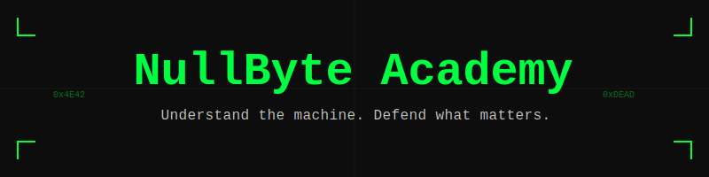

# ⚡ NullByte Academy

> **"Understand the machine. Defend what matters."**

<p align="center">
  
</p>

<p align="center">
  
  
  
  
</p>

---

## 📖 Project Overview

**NullByte Academy** is a professional-grade cybersecurity research and education platform designed for practitioners who refuse to stop at the surface. The curriculum drills into the architecture of modern computing systems — registers, stack frames, virtual memory, instruction sets, and exploit mitigations — and teaches students to reason about security from first principles rather than from tool documentation.

This is not a certification cram course. NullByte Academy is built for the analyst who wants to understand **why** a buffer overflow overwrites a return address, **how** ASLR interacts with position-independent executables, and **what** a disassembled function actually reveals about its original intent.

### What You'll Work With

- **x86/x64 Assembly Language** — Read, analyze, and reason about compiled machine code
- **Stack Frame Analysis** — Understand calling conventions, frame pointers, local variable layout, and return mechanics
- **Reverse Engineering** — Static and dynamic analysis workflows using industry-standard toolchains
- **Memory Internals** — Virtual address spaces, allocator behavior, heap structure, and memory-class vulnerability patterns
- **Exploit Mitigations** — Mechanistic understanding of ASLR, DEP/NX, stack canaries, CFI, and shadow stacks
- **Secure Coding** — Translating low-level security knowledge into better engineering decisions
- **CVE Research** — Reading and structuring analysis of public vulnerability disclosures

---

## 🎯 Learning Objectives

Upon completing the NullByte Academy curriculum, students will be able to:

**Theoretical Competencies**
- Explain the hardware execution model at the register, pipeline, and privilege-ring level
- Describe the complete lifecycle of a function call from caller setup through stack teardown
- Characterize each major memory vulnerability class by its structural root cause
- Articulate the mechanism, bypass history, and current state of each major exploit mitigation

**Lab Competencies**
- Navigate and annotate disassembly output in both Ghidra and GDB
- Reconstruct high-level logic from binary analysis without source access
- Trace heap allocator behavior and identify structural anomalies
- Observe mitigation behavior in controlled, permissioned lab environments

**Practical Competencies**
- Produce structured, academically rigorous vulnerability analysis reports
- Conduct defensible code audits using a structured checklist methodology
- Cross-reference CVE disclosures with root-cause classification frameworks
- Write safer low-level code informed by a concrete understanding of memory behavior

---

## 🗺️ Skill Roadmap

```
BEGINNER ──────────────────────────────────────────────────────────── ELITE
   │                                                                      │
   ▼                                                                      ▼
[M01]              [M02]              [M03]         [M04–M05]         [M06–M07]
CPU & Registers → Memory Layout → Mitigations → RE & Vuln Classes → Research
   │                  │               │               │                  │
Foundation        Architecture    Defenses       Analysis          Independent
Concepts          Internals       Theory         Practice          Research
```

| Stage | Modules | Key Skills |
|-------|---------|------------|
| **Beginner** | M01 | x86/x64 registers, instruction formats, privilege rings, calling conventions |
| **Intermediate** | M02–M03 | Virtual memory, stack/heap layout, ASLR, DEP/NX, stack canaries |
| **Advanced** | M04–M05 | Static/dynamic RE, CFG analysis, memory corruption root cause analysis |
| **Elite** | M06–M07 | Defensive architecture, code auditing, CVE analysis, structured research output |

---

## 📚 Modules and Lab Descriptions

### Module 01 — CPU Architecture & Execution Internals

**Purpose:** Establish the hardware-level mental model every security researcher must own.

**Content:** General-purpose and special-purpose registers (RAX–R15, RSP, RBP, RIP, RFLAGS), instruction pipeline stages, privilege rings (Ring 0–3) and their security implications, x86/x64 calling conventions (System V AMD64, Microsoft x64), and the ABI-level details that make stack analysis possible.

**Lab — LAB-CPU-01:** Instruction tracing using GDB and objdump on purpose-built binaries. Students observe register state across function boundaries and trace execution flow through branching logic.

---

### Module 02 — Memory Layout & Management

**Purpose:** Build a precise, mechanical understanding of how processes occupy and navigate virtual memory.

**Content:** Virtual address space organization (text, data, BSS, heap, stack, mmap regions), stack frame anatomy (saved return address, saved frame pointer, local variables, arguments), heap allocator internals (glibc ptmalloc chunk structure, bin types), and the spatial relationships that define memory-class vulnerabilities.

**Lab — LAB-MEM-01/02:** Stack frame inspection with GDB across multiple call depths. Heap allocation tracing using malloc hook instrumentation on purpose-built programs.

---

### Module 03 — Exploit Mitigations & Modern Defenses

**Purpose:** Understand each mitigation mechanistically — not as a compliance checkbox, but as an engineering decision with specific threat model assumptions.

**Content:** ASLR (entropy sources, per-region randomization, partial overwrite implications), DEP/NX (hardware NX bit, W^X enforcement), stack canaries (placement, terminator canaries, generation), Safe Unlinking (heap unlink integrity checks), CFI (forward-edge, backward-edge, shadow stacks), and RELRO.

**Lab — LAB-MIT-01:** Mitigation behavior observation using a hardened Linux VM. Students use `/proc` interfaces, readelf, and checksec to audit binary and system mitigation posture.

---

### Module 04 — Reverse Engineering Fundamentals

**Purpose:** Develop systematic methodology for understanding software behavior without source code.

**Content:** Static analysis workflow (binary format analysis, disassembly, CFG construction, cross-reference mapping), dynamic analysis workflow (debugger-driven execution, breakpoint strategy, memory inspection), tool orientation (Ghidra, Binary Ninja, GDB with PEDA/pwndbg), and output documentation standards.

**Lab — LAB-RE-01/02:** Ghidra-based analysis of compiled binaries with obfuscated logic. Students produce annotated disassembly reports with reconstructed pseudocode and control flow narrative.

---

### Module 05 — Vulnerability Classes & Root Cause Analysis

**Purpose:** Understand memory corruption and logic vulnerability classes at their structural root — not as exploit recipes, but as engineering failures with identifiable causes.

**Content:** Stack-based buffer overflows (spatial memory safety violation mechanics), heap corruption primitives (use-after-free, double-free, heap overflow — structural analysis only), integer vulnerabilities (signed/unsigned conversion, truncation, wraparound), type confusion, and logic flaws (authentication bypass patterns, TOCTOU).

**Lab — LAB-VUL-01:** Root cause identification exercises using purpose-built vulnerable binaries. Students identify the exact line of code and class of error. No exploit construction. Analysis and documentation only.

---

### Module 06 — Secure Coding & Defensive Architecture

**Purpose:** Apply low-level security knowledge to produce safer software and more rigorous code reviews.

**Content:** Memory-safe coding patterns in C/C++, bounds checking discipline, safe integer arithmetic, allocator discipline (allocation/free pairing, lifetime tracking), trust boundary identification, input validation strategy, and structured code audit methodology.

**Lab — LAB-SEC-01:** Code review exercises against realistic vulnerable codebases. Students produce structured audit reports with CWE classifications and remediation recommendations.

---

### Module 07 — Research Methods & CVE Analysis

**Purpose:** Develop the research skills to produce, consume, and contribute to the security knowledge base.

**Content:** Reading CVE and NVD records, interpreting CVSS scores against actual impact, locating and analyzing vendor advisories, controlled vulnerability reproduction methodology (isolated lab environments only), structured research note-taking, and producing publishable analysis documentation.

**Lab — LAB-RES-01:** Guided CVE reproduction exercises using pre-patched, isolated binaries. Students produce analysis documents following the NullByte Academy research template.

---

## 💻 Interactive Frontend Platform

The NullByte Academy includes a **React-based interactive learning platform** for quizzes, visual stack diagrams, and practical exercises.

### Getting Started

```bash
# Clone the repository
git clone https://github.com/mrwhite4939/nullbyte-academy

# Navigate to the frontend
cd Testing

# Install dependencies
npm install

# Start the development server
npm run dev
```

### Platform Features

| Feature | Description |
|---------|-------------|
| **Interactive Stack Diagrams** | Visualize stack frame construction in real-time as you step through simulated function calls |
| **Assembly Sandbox** | Enter x86/x64 instructions and observe register state changes |
| **Module Quizzes** | Adaptive knowledge checks after each module section |
| **Lab Workbench** | Guided practical exercises with structured answer capture |
| **Progress Tracker** | Personal skill progression map across all seven modules |

### Platform Access

```bash
# Production build
npm run build

# Preview production build
npm run preview

# The platform runs on http://localhost:5173 by default
```

> **Note:** All lab exercises requiring a Linux environment are conducted in the provided VM templates, not in the browser. The frontend platform handles theory content, quizzes, and diagram-based visualization only.

---

## 🎨 Cyberpunk Branding & Visual Identity

NullByte Academy's visual design communicates precision, technical depth, and elite-level focus.

| Element | Specification |
|---------|---------------|
| **Primary Background** | `#0D0D0D` — Midnight black |
| **Terminal Green** | `#00FF41` — Primary accent, headers, highlights |
| **Alert Amber** | `#FFA500` — Warning states, critical callouts |
| **Neon Blue** | `#00BFFF` — Secondary accent, links, interactive elements |
| **Cool White** | `#F0F0F0` — Body text on dark backgrounds |
| **Code Font** | JetBrains Mono — All code, terminal output, technical labels |
| **Body Font** | Inter — Prose, descriptions, UI text |

The aesthetic draws from terminal interfaces and low-level tooling — intentionally minimal, intentionally monochromatic, intentionally dense. No gradients for decoration. No animations for attention. Every visual element serves communication.

---

## 📎 Reference Materials

All supplemental materials are located in the `/modules`, `/labs`, `/presentations`, and `/reference` directories:

| File | Type | Module |
|------|------|--------|
| `intro_cpu_architecture.pdf` | PDF | M01 |
| `intro_memory_management.pdf` | PDF | M02 |
| `intro_mitigations.pdf` | PDF | M03 |
| `intro_reverse_engineering.pdf` | PDF | M04 |
| `intro_vuln_classes.pdf` | PDF | M05 |
| `intro_secure_coding.pdf` | PDF | M06 |
| `intro_research_methods.pdf` | PDF | M07 |
| `Module01_Intro.pptx` | Presentation | M01 |
| `Module02_StackFrames.pptx` | Presentation | M02 |
| `Module03_Assembly.pptx` | Presentation | M03 |
| `Module04_ReverseEngineering.pptx` | Presentation | M04 |
| `Module05_AdvancedLabs.pptx` | Presentation | M05 |

---

## 📁 Project Structure

```
NullByte-Academy/
│
├── README.md                    # Project overview and quick-start
├── LICENSE                      # MIT License
├── SECURITY.md                  # Responsible disclosure policy
├── CONTRIBUTING.md              # Contributor workflow and standards
├── CHANGELOG.md                 # Version history
├── FAQ.md                       # Frequently asked questions
├── CODE_OF_CONDUCT.md           # Community conduct expectations
├── COURSE_VISUALS.md            # Full curriculum reference guide with diagrams
├── ARCHITECTURE.md              # Platform architecture overview
├── ROADMAP.md                   # Development and content roadmap
├── ACKNOWLEDGEMENTS.md          # Tools, references, and attributions
├── VERSION                      # Current version identifier
└── .gitignore                   # Repository hygiene
│
├── assets/
│   └── Logo/                    # Brand assets, SVG/PNG diagrams
│
├── presentations/
│   ├── Module01_Intro.pptx
│   ├── Module02_StackFrames.pptx
│   ├── Module03_Assembly.pptx
│   ├── Module04_ReverseEngineering.pptx
│   └── Module05_AdvancedLabs.pptx
│
├── modules/
│   ├── 01_ACADEMY_MASTER_BLUEPRINT.md
│   ├── 02_ETHICS.md
│   ├── 03_STYLE_GUIDE.md
│   ├── 04_GLOSSARY.md
│   ├── 05_CURRICULUM_MAP.md
│   ├── 06_ZERO_DAY_RESEARCH_FRAMEWORK.md
│   ├── 07_SECURE_DESIGN_PRINCIPLES.md
│   ├── 08_ADVANCED_LABS_OVERVIEW.md
│   ├── 09_CASE_STUDIES_DEFENSIVE.md
│   ├── 10_THREAT_MODELING.md
│   └── 11_FINAL_PROJECT_GUIDELINES.md
│
├── labs/
│   ├── lab01_execution_model.md
│   ├── lab02_stack_analysis.md
│   ├── lab03_opcode_study.md
│   ├── lab04_cfg_reconstruction.md
│   ├── lab05_memory_failure_autopsy.md
│   └── lab06_mitigation_modeling.md
│
├── Logo/
│   ├── 01_cpu_fetch_decode_execute.svg
│   ├── 02_x86_64_registers.svg
│   ├── 03_stack_frame_layout.svg
│   ├── 04_virtual_address_space.svg
│   ├── 05_instruction_encoding.svg
│   ├── 06_protection_stack.svg
│   ├── 07_calling_conventions.svg
│   ├── 08_reverse_engineering_workflow.svg
│   ├── 09_responsible_disclosure.svg
│   ├── 10_nullbyte_academy_logo.svg
│   ├── 11_memory_hierarchy.svg
│   └── 12_heap_ptmalloc_layout.svg
│
├── reference/
│   ├── NullByte_Academy_Book.docx
│   ├── NullByte_Academy_Curriculum.docx
│   ├── NullByte_Academy_Intro_Spec.pdf
│   ├── NullByte_Academy_Reference.xlsx
│   ├── Advanced_Defensive_Systems_Engineering_Masterclass.docx
│   └── Systems_Reference_Workbook.xlsx
│
└── Testing/                     # Interactive React quiz app
    ├── package.json
    ├── vite.config.js
    ├── index.html
    ├── netlify.toml
    └── src/
        ├── App.jsx
        ├── main.jsx
        ├── components/
        └── data/
```

---

## 📬 Contact

**NullByte Academy** is an independent educational research project.

- **Security Issues:** See [SECURITY.md](SECURITY.md) for responsible disclosure process
- **General Inquiries:** `mrwhite4939@gmail.com`
- **GitHub:** [github.com/nullbyte-academy](https://github.com/nullbyte-academy)

---

<p align="center">
  <em>© 2026 NullByte Academy — Built for those who need to know how it actually works.</em>
</p>

# Course-NullByte
# Course-NullByte
# Course-NullByte
